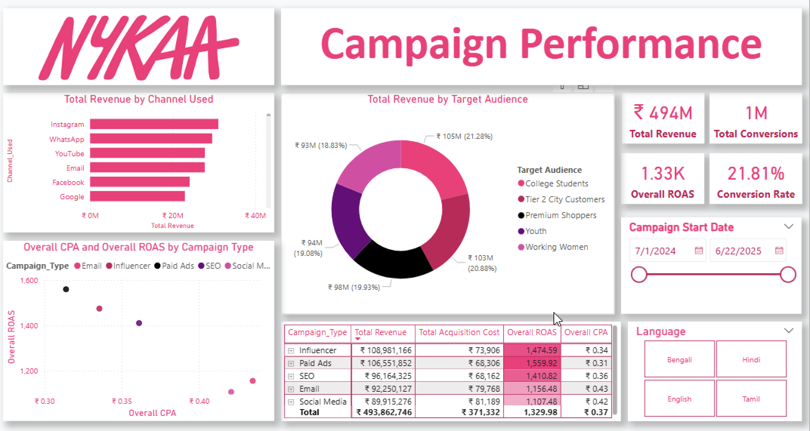
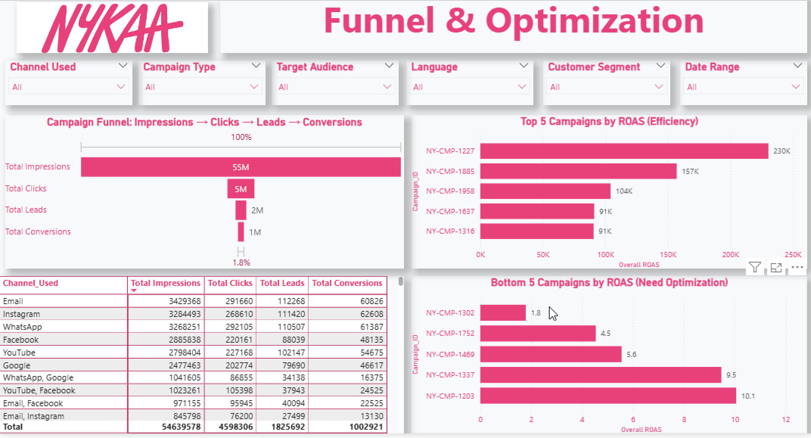

# 📊 Nykaa Marketing Campaign Performance Analytics

> **An end-to-end SQL + Power BI analytics 
> pipeline that transforms 55,000+ rows of 
> raw marketing data into actionable budget 
> allocation intelligence — identifying which 
> channels, audiences, and campaign types 
> actually drive revenue vs which ones burn 
> budget.**

[](https://mysql.com)
[](https://powerbi.microsoft.com)
[](https://kaggle.com)
[]()

---

## 🎯 The Business Problem

Nykaa runs marketing campaigns across 
multiple digital channels simultaneously. 
Without a unified performance view, 
marketing teams face a critical question:

> *"Which campaigns are driving real revenue 
> — and which ones are burning budget with 
> nothing to show for it?"*

High impressions ≠ high returns. 
This project builds the analytical 
infrastructure to answer that question 
with data, not gut feel.

---

## 📈 Key Results

| Metric | Finding |
|--------|---------|
| Dataset size | 55,555 rows · 16 columns |
| Pipeline stages | Raw → Fact → Aggregate → View → Dashboard |
| Biggest funnel drop | Leads → Conversions (not Clicks → Leads) |
| Key insight | High-visibility campaigns ≠ high ROAS |
| Recommendation | Reallocate budget to top 3 channels by ROAS |

---

## 💡 Business Insights That Drive Decisions

**1. Channel efficiency gap — where to reallocate budget:**
A small subset of channels consistently 
delivered ROAS above average while others 
showed high acquisition cost with low 
conversion. Clear candidates for budget cuts 
identified and quantified.

**2. Audience targeting is the biggest lever:**
Specific segments converted at significantly 
higher rates. Concentrating campaigns on 
these segments vs spreading evenly would 
materially improve overall campaign ROI.

**3. The funnel problem is post-interest, 
not pre-interest:**
The biggest drop occurs between Leads and 
Conversions — not between Clicks and Leads. 
This means the issue is follow-up and 
nurturing, not ad creative or reach. 
Marketing budget is not the problem. 
Sales follow-up process is.

**4. Vanity metrics vs efficiency metrics:**
Some campaign types generated strong 
impressions and clicks but poor ROAS. 
Volume metrics (impressions, clicks) tell 
a completely different story than efficiency 
metrics (CPA, ROAS). Optimizing for the 
wrong metric costs money.

---

## 🛠️ ETL Pipeline Architecture

```
Raw CSV (55,555 rows)
    ↓
MySQL Import → nykaa_campaign_raw
    ↓
02_fact_nykaa_campaign_performance.sql
(cleaning, date parsing, standardization)
    ↓
03_agg_nykaa_campaign_performance.sql
(aggregation by campaign × channel × audience)
    ↓
04_vw_nykaa_campaign_metrics.sql
(derived metrics: CTR, CPC, CPA, ROAS)
    ↓
05_export_for_power_bi.sql
(export to CSV for dashboard)
    ↓
Power BI Dashboard (2 pages)
```

**Derived Marketing Metrics Built:**

| Metric | Formula | Business Use |
|--------|---------|--------------|
| CTR | Clicks / Impressions | Ad creative effectiveness |
| CPC | Cost / Clicks | Channel cost efficiency |
| CPA | Cost / Conversions | True acquisition cost |
| Conversion Rate | Conversions / Leads | Funnel health |
| ROAS | Revenue / Cost | Budget allocation |

---

## 🖼️ Dashboard

### Page 1 — Campaign Performance Overview


### Page 2 — Funnel & Optimization Analysis


---

## 💻 How to Run

```bash
# Clone the repo
git clone https://github.com/VikasDs007/nykaa-marketing-campaign-analytics.git
```

**MySQL Setup:**
```sql
-- Run scripts in this exact order:
00_use_database.sql          -- create database
-- Import nykaa_campaign_raw.csv via wizard
02_fact_nykaa_campaign_performance.sql
03_agg_nykaa_campaign_performance.sql
04_vw_nykaa_campaign_metrics.sql
05_export_for_power_bi.sql   -- exports to processed/
```

**Power BI:**
Open `docs/Nykaa_Marketing_Campaign_Performance_Dashboard.pbix`
or connect to `data/processed/vw_nykaa_campaign_metrics.csv`

---

## 🗂️ Project Structure

```
nykaa-marketing-campaign-analytics/
│
├── sql/
│   ├── 00_use_database.sql
│   ├── 02_fact_nykaa_campaign_performance.sql
│   ├── 03_agg_nykaa_campaign_performance.sql
│   ├── 04_vw_nykaa_campaign_metrics.sql
│   └── 05_export_for_power_bi.sql
│
├── data/
│   ├── raw/nykaa_campaign_raw.csv
│   └── processed/vw_nykaa_campaign_metrics.csv
│
├── docs/
│   └── Nykaa_Marketing_Campaign_Performance_Dashboard.pbix
│
├── images/
│   ├── Nykaa_Marketing_Campaign_dashboard_1.png
│   └── Nykaa_Marketing_Campaign_dashboard_2.png
│
└── Dashboard Report/
    └── Nykaa Marketing Campaign Performance Report.pdf
```

---

## 🔮 Future Enhancements

- [ ] **Python automation** — replace manual 
      CSV export with automated pandas pipeline
- [ ] **Predictive budget allocation** — ML 
      model to recommend optimal channel 
      spend split based on historical ROAS
- [ ] **LLM layer** — natural language Q&A: 
      "Which campaign type should we increase 
      budget for next quarter?"
- [ ] **Real-time dashboard** — connect to 
      live campaign data via API instead of 
      static CSV

---

## 🧠 Skills Demonstrated

| Category | Skills |
|----------|--------|
| SQL | Data cleaning, date parsing, GROUP BY aggregation, reusable views, ETL pipeline |
| Marketing Analytics | CTR, CPC, CPA, Conversion Rate, ROAS, funnel analysis |
| Business Intelligence | Power BI, DAX measures, interactive dashboards |
| Business Communication | Translating metrics into budget decisions |

---

## 👤 Author

**Vikas Chaurasia** — Data Analyst | 
AI-Powered Analytics

[](https://linkedin.com/in/vikasds007)
[](https://github.com/VikasDs007)
[](https://vikasds007.github.io)

---

*If this project was useful, a ⭐ means a lot!*

---
